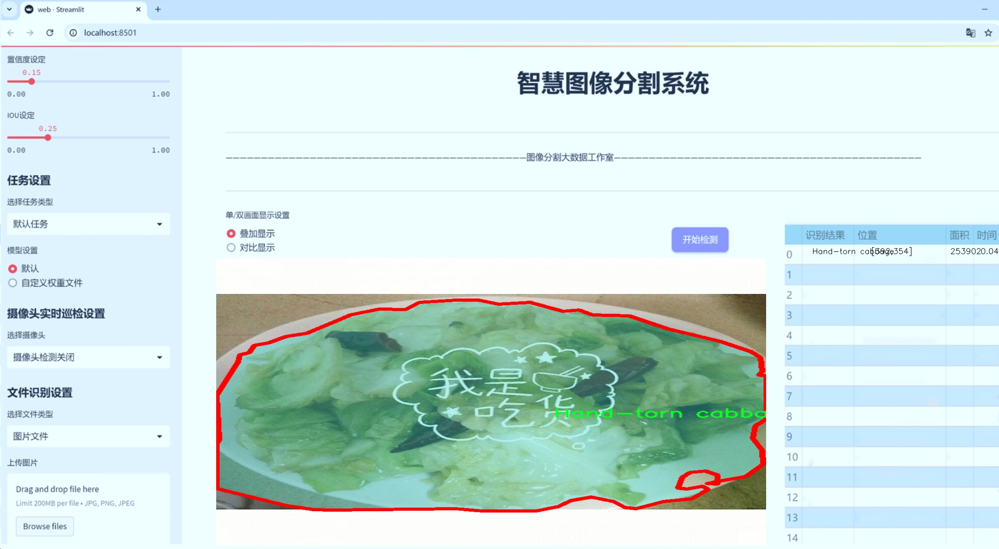
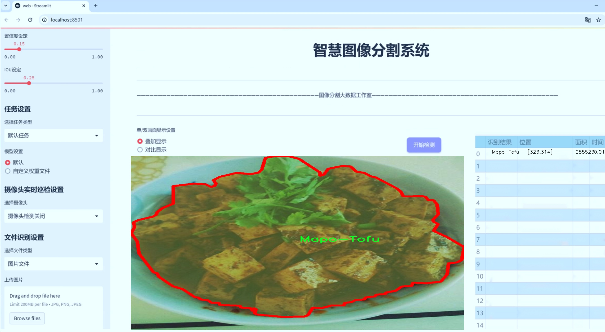
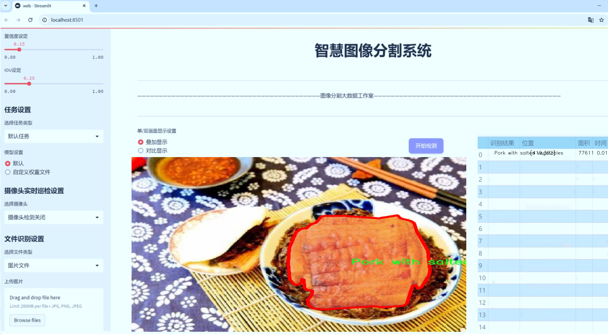
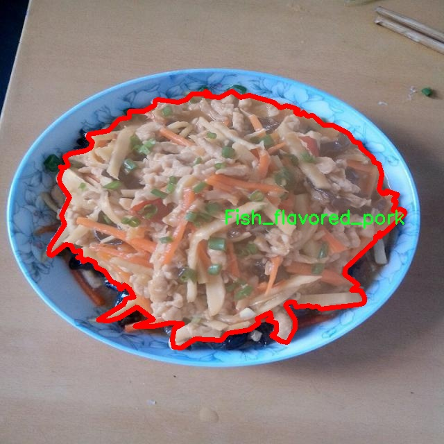
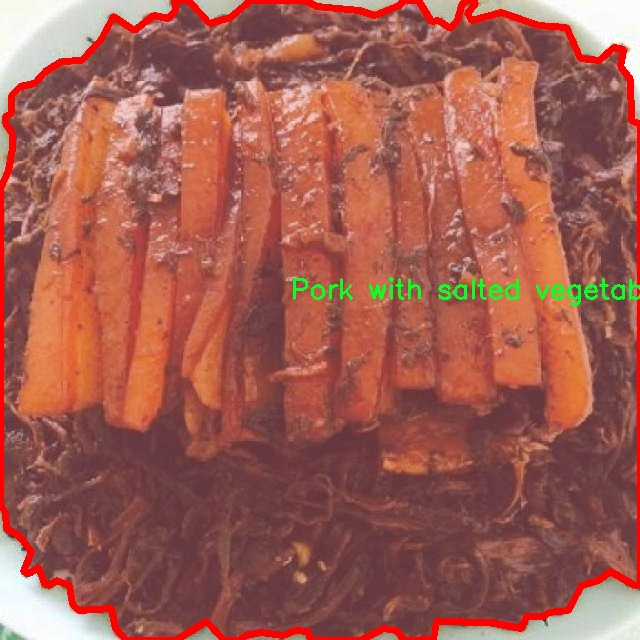
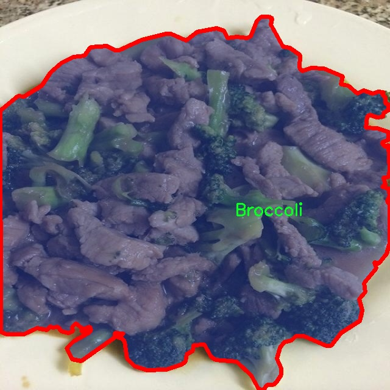
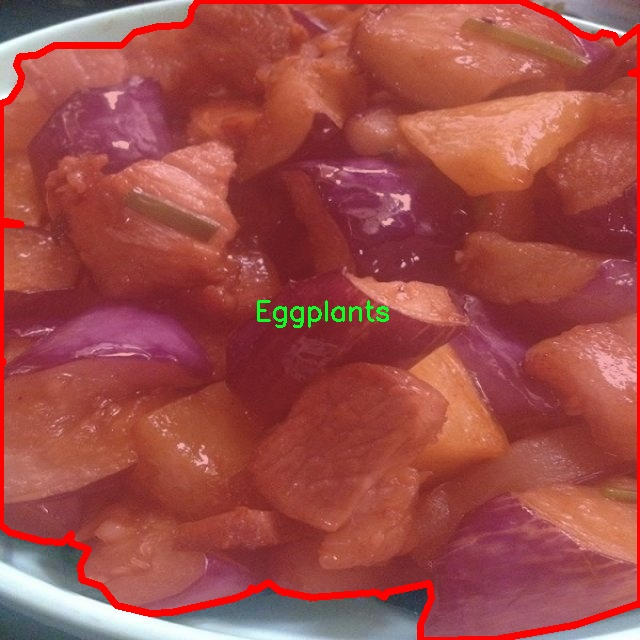
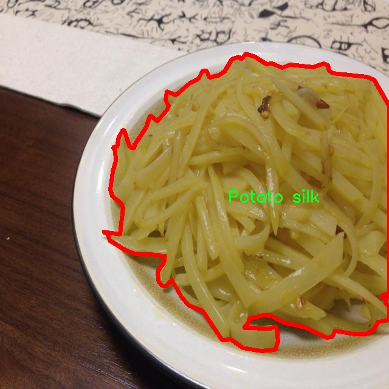

# 中式美食图像分割系统： yolov8-seg-SPPF-LSKA

### 1.研究背景与意义

[参考博客](https://gitee.com/YOLOv8_YOLOv11_Segmentation_Studio/projects)

[博客来源](https://kdocs.cn/l/cszuIiCKVNis)

研究背景与意义

随着全球化的加速和文化交流的深入，中式美食逐渐受到越来越多国家和地区的欢迎。中式美食不仅以其独特的风味和丰富的文化内涵吸引了众多食客，也成为了中华文化的重要代表。然而，尽管中式美食在国际上的影响力不断提升，相关的图像识别和分割技术的研究仍然相对滞后。尤其是在图像分割领域，针对中式美食的研究相对较少，现有的技术往往无法有效处理复杂的美食图像，导致识别准确率低，无法满足实际应用需求。因此，基于改进YOLOv8的中式美食图像分割系统的研究显得尤为重要。

YOLO（You Only Look Once）系列模型以其高效的实时目标检测能力而闻名，YOLOv8作为该系列的最新版本，在准确性和速度上都有了显著提升。然而，针对特定领域的应用，尤其是中式美食图像的分割，仍然需要进行针对性的改进和优化。通过对YOLOv8模型的改进，可以更好地适应中式美食图像的特点，提高模型在复杂背景下的分割能力，从而为中式美食的自动识别和分类提供更为精准的技术支持。

本研究所使用的“Chinese foodset”数据集包含8300张中式美食图像，涵盖了11个不同的类别，如炸莲藕、茄子、麻婆豆腐等。这些类别不仅反映了中式美食的多样性，也为模型的训练提供了丰富的样本。通过对这些图像进行深度学习训练，模型能够学习到不同美食的特征和细节，从而在实际应用中实现高效的图像分割。数据集的多样性和丰富性为模型的泛化能力提供了良好的基础，使其能够在不同场景下进行有效的美食识别和分割。

此外，随着人工智能技术的不断发展，图像分割在食品工业、餐饮服务和智能家居等领域的应用前景广阔。通过构建一个高效的中式美食图像分割系统，不仅可以提升餐饮行业的智能化水平，还能为消费者提供更为便捷的美食选择和推荐服务。同时，该系统的成功实施也将为其他类型美食的图像识别和分割提供借鉴，推动整个食品图像处理领域的发展。

综上所述，基于改进YOLOv8的中式美食图像分割系统的研究，不仅具有重要的学术价值，也具有广泛的应用前景。通过提升中式美食图像的分割精度和效率，能够更好地满足市场需求，推动中式美食文化的传播与发展。

### 2.图片演示







注意：本项目提供完整的训练源码数据集和训练教程,由于此博客编辑较早,暂不提供权重文件（best.pt）,需要按照6.训练教程进行训练后实现上图效果。

### 3.视频演示

[3.1 视频演示](https://www.bilibili.com/video/BV1rPUbYCECm/)

### 4.数据集信息

##### 4.1 数据集类别数＆类别名

nc: 11
names: ['-', 'Broccoli', 'Deep Fried lotus root', 'Eggplants', 'Fish_flavored_pork', 'Hand-torn cabbage', 'Mapo-Tofu', 'Pork with salted vegetables', 'Potato silk', 'Sauteed bean sprouts', 'Scrambled-eggs-with-tomatoes']


##### 4.2 数据集信息简介

数据集信息展示

在本研究中，我们采用了名为“Chinese foodset”的数据集，以支持改进YOLOv8-seg的中式美食图像分割系统的训练与测试。该数据集专注于中式美食的多样性，涵盖了11个不同的类别，旨在提高模型在识别和分割中式菜肴方面的准确性和鲁棒性。数据集的设计考虑到了中式美食的丰富性和复杂性，确保了模型能够在多种场景下有效工作。

“Chinese foodset”数据集中包含的类别包括：西兰花、炸莲藕、茄子、鱼香肉丝、手撕包菜、麻辣豆腐、咸菜肉、土豆丝、炒豆芽和西红柿炒鸡蛋。这些类别不仅代表了中国饮食文化中的经典菜肴，也体现了不同地区的饮食习惯和风味特色。每一类菜肴都具有独特的外观和颜色特征，这为图像分割任务提供了丰富的挑战。

在数据集的构建过程中，研究团队通过多种渠道收集了大量的中式美食图像，确保了数据的多样性和代表性。图像的拍摄环境、光照条件和角度各异，使得数据集能够更好地模拟真实世界中的应用场景。此外，为了增强模型的泛化能力，数据集中还包含了不同的背景和摆盘方式，进一步增加了图像分割的复杂性。

为了确保数据集的高质量，所有图像都经过严格的标注和审核。每一张图像中的菜肴都被精确地标记，确保模型在训练过程中能够学习到每个类别的特征。这种精细的标注不仅提高了模型的学习效率，也为后续的评估提供了可靠的依据。

在模型训练阶段，研究团队将“Chinese foodset”数据集划分为训练集、验证集和测试集，以便于对模型性能进行全面评估。训练集用于模型的学习，验证集用于调整模型参数，而测试集则用于最终的性能评估。通过这种方式，我们能够确保模型在不同数据集上的表现一致性，从而提高其在实际应用中的可靠性。

在进行图像分割任务时，YOLOv8-seg模型将利用“Chinese foodset”数据集中的图像和标注信息，进行特征提取和分类。模型通过学习不同菜肴的形状、颜色和纹理特征，能够实现对中式美食的精准分割。这一过程不仅提升了模型的识别能力，也为后续的图像处理和分析奠定了基础。

总之，“Chinese foodset”数据集为改进YOLOv8-seg的中式美食图像分割系统提供了丰富的资源和支持。通过高质量的图像和准确的标注，该数据集不仅推动了中式美食图像分割技术的发展，也为未来的研究提供了重要的参考和借鉴。随着技术的不断进步，我们期待该数据集能够在更广泛的应用场景中发挥作用，助力中式美食的数字化和智能化发展。











### 5.项目依赖环境部署教程（零基础手把手教学）

[5.1 环境部署教程链接（零基础手把手教学）](https://www.bilibili.com/video/BV1jG4Ve4E9t/?vd_source=bc9aec86d164b67a7004b996143742dc)


[5.2 安装Python虚拟环境创建和依赖库安装视频教程链接（零基础手把手教学）](https://www.bilibili.com/video/BV1nA4VeYEze/?vd_source=bc9aec86d164b67a7004b996143742dc)

### 6.手把手YOLOV8-seg训练视频教程（零基础手把手教学）

[6.1 手把手YOLOV8-seg训练视频教程（零基础小白有手就能学会）](https://www.bilibili.com/video/BV1cA4VeYETe/?vd_source=bc9aec86d164b67a7004b996143742dc)


按照上面的训练视频教程链接加载项目提供的数据集，运行train.py即可开始训练



     Epoch   gpu_mem       box       obj       cls    labels  img_size
     1/200     0G   0.01576   0.01955  0.007536        22      1280: 100%|██████████| 849/849 [14:42<00:00,  1.04s/it]
               Class     Images     Labels          P          R     mAP@.5 mAP@.5:.95: 100%|██████████| 213/213 [01:14<00:00,  2.87it/s]
                 all       3395      17314      0.994      0.957      0.0957      0.0843

     Epoch   gpu_mem       box       obj       cls    labels  img_size
     2/200     0G   0.01578   0.01923  0.007006        22      1280: 100%|██████████| 849/849 [14:44<00:00,  1.04s/it]
               Class     Images     Labels          P          R     mAP@.5 mAP@.5:.95: 100%|██████████| 213/213 [01:12<00:00,  2.95it/s]
                 all       3395      17314      0.996      0.956      0.0957      0.0845

     Epoch   gpu_mem       box       obj       cls    labels  img_size
     3/200     0G   0.01561    0.0191  0.006895        27      1280: 100%|██████████| 849/849 [10:56<00:00,  1.29it/s]
               Class     Images     Labels          P          R     mAP@.5 mAP@.5:.95: 100%|███████   | 187/213 [00:52<00:00,  4.04it/s]
                 all       3395      17314      0.996      0.957      0.0957      0.0845


### 7.50+种全套YOLOV8-seg创新点加载调参实验视频教程（一键加载写好的改进模型的配置文件）

[7.1 50+种全套YOLOV8-seg创新点加载调参实验视频教程（一键加载写好的改进模型的配置文件）](https://www.bilibili.com/video/BV1Hw4VePEXv/?vd_source=bc9aec86d164b67a7004b996143742dc)

### YOLOV8-seg算法简介

原始YOLOV8-seg算法原理

YOLO（You Only Look Once）系列算法自其诞生以来，便以其卓越的实时目标检测能力而广受欢迎。随着技术的不断进步，YOLO系列也在不断演化，最新的YOLOv8-seg算法在此基础上进一步提升了性能，特别是在图像分割任务中的应用。YOLOv8-seg算法不仅继承了YOLO系列的优良特性，还在网络结构、损失函数和数据处理等多个方面进行了创新和优化，使其在多种复杂场景下都能表现出色。

YOLOv8-seg算法的基本结构可分为输入端、主干网络、颈部（Neck）和输出端（Head）四个主要部分。输入端负责对输入图像进行预处理，包括Mosaic数据增强、自适应图像缩放和灰度填充等操作，以提高模型的鲁棒性和泛化能力。通过这些预处理步骤，YOLOv8-seg能够有效地捕捉到图像中的多样性和复杂性，为后续的特征提取奠定基础。

在主干网络部分，YOLOv8-seg采用了改进的DarkNet结构，其中C2f模块的引入是一个重要的创新。C2f模块结合了YOLOv5中的C3模块和YOLOv7中的ELAN模块的优点，增加了更多的残差连接，从而在保持轻量化的同时，获得了更丰富的梯度信息。这种设计使得网络在特征提取过程中能够更好地保留细粒度的上下文信息，尤其是在处理复杂背景和小目标时，表现得尤为突出。

颈部部分则采用了PAN（Path Aggregation Network）结构，通过上下采样和特征拼接来融合不同尺度的特征图。这种特征融合策略有效地增强了网络对不同尺度目标的检测能力，特别是在处理小目标时，能够显著提高其感知能力。YOLOv8-seg的颈部设计还采用了双塔结构，这种结构不仅促进了语义特征和定位特征的转移，还进一步巩固了网络的特征融合能力，使得模型在复杂场景下的表现更加出色。

在输出端，YOLOv8-seg采用了解耦合头结构，将分类和回归任务分开处理。这种设计不仅提高了模型的训练效率，还加速了模型的收敛过程。此外，YOLOv8-seg还将传统的Anchor-Based方法替换为Anchor-Free的方法，这一转变使得模型在检测精度和速度上都有了显著提升。通过解耦合头的设计，YOLOv8-seg能够更好地处理正负样本的匹配问题，从而提高了检测的准确性。

在损失函数的设计上，YOLOv8-seg采用了BCELoss作为分类损失，DFLLoss和CIoULoss作为回归损失。这种组合不仅提高了模型的训练稳定性，还增强了其对小目标的检测能力。尤其是在复杂的水面环境中，YOLOv8-seg能够有效地减轻噪声影响，提高对小目标的感知能力。

值得一提的是，YOLOv8-seg在训练过程中引入了动态Task-Aligned Assigner样本分配策略。这一策略通过对分类分数和回归分数的加权匹配，进一步优化了正样本的选择，从而提高了模型的训练效率和检测精度。结合这些创新，YOLOv8-seg在处理复杂背景和小目标时，展现出了更强的鲁棒性和准确性。

总的来说，YOLOv8-seg算法通过一系列的结构优化和创新，显著提升了目标检测和图像分割的性能。其在网络结构上的改进、损失函数的优化以及数据处理策略的创新，使得YOLOv8-seg在复杂场景下依然能够保持高效的检测能力。这些特性使得YOLOv8-seg不仅适用于一般的目标检测任务，也为图像分割等更复杂的视觉任务提供了强有力的支持，展示了YOLO系列算法在计算机视觉领域的广泛应用潜力。随着YOLOv8-seg的不断发展和完善，我们有理由相信，其在未来的图像处理和计算机视觉应用中将发挥更为重要的作用。


### 9.系统功能展示（检测对象为举例，实际内容以本项目数据集为准）

图9.1.系统支持检测结果表格显示

  图9.2.系统支持置信度和IOU阈值手动调节

  图9.3.系统支持自定义加载权重文件best.pt(需要你通过步骤5中训练获得)

  图9.4.系统支持摄像头实时识别

  图9.5.系统支持图片识别

  图9.6.系统支持视频识别

  图9.7.系统支持识别结果文件自动保存

  图9.8.系统支持Excel导出检测结果数据


### 10.50+种全套YOLOV8-seg创新点原理讲解（非科班也可以轻松写刊发刊，V11版本正在科研待更新）

#### 10.1 由于篇幅限制，每个创新点的具体原理讲解就不一一展开，具体见下列网址中的创新点对应子项目的技术原理博客网址【Blog】：


[10.1 50+种全套YOLOV8-seg创新点原理讲解链接](https://gitee.com/qunmasj/good)

#### 10.2 部分改进模块原理讲解(完整的改进原理见上图和技术博客链接)【如果此小节的图加载失败可以通过CSDN或者Github搜索该博客的标题访问原始博客，原始博客图片显示正常】

### YOLOv8模型
YOLOv8模型由Ultralytics团队在YOLOv5模型的基础上，吸收了近两年半来经过实际验证的各种改进，于2023年1月提出。与之前的一些YOLO 系列模型想类似，YOLOv8模型也有多种尺寸，下面以YOLOv8n为例，分析 YOLOv8模型的结构和改进点。YOLOv8模型网络结构如
输入图片的部分，由于发现Mosaic数据增强尽管这有助于提升模型的鲁棒性和泛化性，但是，在一定程度上，也会破坏数据的真实分布，使得模型学习到一些不好的信息。所以YOLOv8模型在训练中的最后10个epoch 停止使用Mosaic数据增强。


在网络结构上，首先主干网络的改变不大，主要是将C3模块替换为了C2f模块，该模块的结构在上图中已示出。C2f模块在C3模块的思路基础上，引入了YOLOv7中 ELAN的思路，引入了更多的跳层连接，这有助于该模块获得更丰富的梯度流信息，而且模型的轻量化得到了保证。依然保留了SPPF，效果不变的同时减少了该模块的执行时间。
在颈部网络中，也是将所有的C3模块更改为C2f模块，同时删除了两处上采样之前的卷积连接层。
在头部网络中，采用了YOLOX中使用的解耦头的思路，两条并行的分支分别提取类别和位置特征。由于分类任务更注重于分析特征图中提取到的特征与已输入图片的部分，由于发现 Mosaic数据增强尽管这有助于提升模型的鲁棒性和泛化性，但是，在一定程度上，也会破坏数据的真实分布，使得模型学习到一些不好的信息。所以YOLOv8模型在训练中的最后10个epoch停止使用Mosaic数据增强。
在网络结构上，首先主干网络的改变不大，主要是将C3模块替换为了C2f模块，该模块的结构在上图中已示出。C2f模块在C3模块的思路基础上，引入了YOLOv7中ELAN的思路，引入了更多的跳层连接，这有助于该模块获得更丰富的梯度流信息，而且模型的轻量化得到了保证。依然保留了SPPF，效果不变的同时减少了该模块的执行时间。
在颈部网络中，也是将所有的C3模块更改为C2f模块，同时删除了两处上采样之前的卷积连接层。
在头部网络中，采用了YOLOX中使用的解耦头的思路，两条并行的分支分别提取类别和位置特征。由于分类任务更注重于分析特征图中提取到的特征与已有类别中的哪一种更为相似，而定位任务更关注边界框与真值框的位置关系，并据此对边界框的坐标进行调整。侧重点的不同使得在使用两个检测头时收敛的速度和预测的精度有所提高。而且使用了无锚框结构，直接预测目标的中心，并使用TAL (Task Alignment Learning，任务对齐学习）来区分正负样本，引入了分类分数和IOU的高次幂乘积作为衡量任务对齐程度的指标，认为同时拥有好的定位和分类评价的在分类和定位损失函数中也引入了这项指标。
在模型的检测结果上，YOLOv8模型也取得了较好的成果，图为官方在coCO数据集上 YOLOv8模型的模型尺寸大小和检测的mAP50-95对比图。mAP50-95指的是IOU的值从50%取到95%，步长为5%，然后算在这些IOU下的mAP的均值。图的 a）图展示了YOLOv8在同尺寸下模型中参数没有较大增加的前提下取得了比其他模型更好的精度，图2-17的b)图展示了YOLOv8比其他YOLO系列模型在同尺寸时，推理速度更快且精度没有太大下降。


### 视觉transformer(ViT)简介
视觉transformer(ViT)最近在各种计算机视觉任务中证明了巨大的成功，并受到了相当多的关注。与卷积神经网络(CNNs)相比，ViT具有更强的全局信息捕获能力和远程交互能力，表现出优于CNNs的准确性，特别是在扩大训练数据大小和模型大小时[An image is worth 16x16 words: Transformers for image recognition at scale,Coatnet]。

尽管ViT在低分辨率和高计算领域取得了巨大成功，但在高分辨率和低计算场景下，ViT仍不如cnn。例如，下图(左)比较了COCO数据集上当前基于cnn和基于vit的一级检测器。基于vit的检测器(160G mac)和基于cnn的检测器(6G mac)之间的效率差距超过一个数量级。这阻碍了在边缘设备的实时高分辨率视觉应用程序上部署ViT。


左图:现有的基于vit的一级检测器在实时目标检测方面仍然不如当前基于cnn的一级检测器，需要的计算量多出一个数量级。本文引入了第一个基于vit的实时对象检测器来弥补这一差距。在COCO上，efficientvit的AP比efficientdet高3.8，而mac较低。与YoloX相比，efficient ViT节省67.2%的计算成本，同时提供更高的AP。

中:随着输入分辨率的增加，计算成本呈二次增长，无法有效处理高分辨率的视觉应用。

右图:高分辨率对图像分割很重要。当输入分辨率从1024x2048降低到512x1024时，MobileNetV2的mIoU减少12% (8.5 mIoU)。在不提高分辨率的情况下，只提高模型尺寸是无法缩小性能差距的。

ViT的根本计算瓶颈是softmax注意模块，其计算成本随输入分辨率的增加呈二次增长。例如，如上图(中)所示，随着输入分辨率的增加，vit- small[Pytorch image models. https://github.com/rwightman/ pytorch-image-models]的计算成本迅速显著大于ResNet-152的计算成本。

解决这个问题的一个直接方法是降低输入分辨率。然而，高分辨率的视觉识别在许多现实世界的计算机视觉应用中是必不可少的，如自动驾驶，医疗图像处理等。当输入分辨率降低时，图像中的小物体和精细细节会消失，导致目标检测和语义分割性能显著下降。

上图(右)显示了在cityscape数据集上不同输入分辨率和宽度乘法器下MobileNetV2的性能。例如，将输入分辨率从1024x2048降低到512x1024会使cityscape的性能降低12% (8.5 mIoU)。即使是3.6倍高的mac，只放大模型尺寸而不增加分辨率也无法弥补这一性能损失。

除了降低分辨率外，另一种代表性的方法是限制softmax注意，方法是将其范围限制在固定大小的局部窗口内[Swin transformer,Swin transformer v2]或降低键/值张量的维数[Pyramid vision transformer,Segformer]。然而，它损害了ViT的非局部注意能力，降低了全局接受域(ViT最重要的优点)，使得ViT与大内核cnn的区别更小[A convnet for the 2020s,Scaling up your kernels to 31x31: Revisiting large kernel design in cnns,Lite pose: Efficient architecture design for 2d human pose estimation]。

本文介绍了一个有效的ViT体系结构，以解决这些挑战。发现没有必要坚持softmax注意力。本文建议用线性注意[Transformers are rnns: Fast autoregressive transformers with linear attention]代替softmax注意。

线性注意的关键好处是，它保持了完整的n 2 n^2n 2
 注意映射，就像softmax注意。同时，它利用矩阵乘法的联想特性，避免显式计算完整的注意映射，同时保持相同的功能。因此，它保持了softmax注意力的全局特征提取能力，且计算复杂度仅为线性。线性注意的另一个关键优点是它避免了softmax，这使得它在移动设备上更有效(下图左)。


左图:线性注意比类似mac下的softmax注意快3.3-4.5倍，这是因为去掉了硬件效率不高的softmax功能。延迟是在Qualcomm Snapdragon 855 CPU和TensorFlow-Lite上测量的。本文增加线性注意的头部数量，以确保它具有与softmax注意相似的mac。

中:然而，如果没有softmax注意中使用的非线性注意评分归一化，线性注意无法有效集中其注意分布，削弱了其局部特征提取能力。后文提供了可视化。

右图:本文用深度卷积增强线性注意，以解决线性注意的局限性。深度卷积可以有效地捕捉局部特征，而线性注意可以专注于捕捉全局信息。增强的线性注意在保持线性注意的效率和简单性的同时，表现出在各种视觉任务上的强大表现(图4)。

然而，直接应用线性注意也有缺点。以往的研究表明线性注意和softmax注意之间存在显著的性能差距(下图中间)。


左:高通骁龙855上的精度和延迟权衡。效率vit比效率网快3倍，精度更高。中:ImageNet上softmax注意与线性注意的比较。在相同的计算条件下，本文观察到softmax注意与线性注意之间存在显著的精度差距。而深度卷积增强模型后，线性注意的精度有明显提高。

相比之下，softmax注意的精度变化不大。在相同MAC约束下，增强线性注意比增强软最大注意提高了0.3%的精度。右图:与增强的softmax注意相比，增强的线性注意硬件效率更高，随着分辨率的增加，延迟增长更慢。

深入研究线性注意和softmax注意的详细公式，一个关键的区别是线性注意缺乏非线性注意评分归一化方案。这使得线性注意无法有效地将注意力分布集中在局部模式产生的高注意分数上，从而削弱了其局部特征提取能力。

本文认为这是线性注意的主要限制，使其性能不如softmax注意。本文提出了一个简单而有效的解决方案来解决这一限制，同时保持线性注意在低复杂度和低硬件延迟方面的优势。具体来说，本文建议通过在每个FFN层中插入额外的深度卷积来增强线性注意。因此，本文不需要依赖线性注意进行局部特征提取，避免了线性注意在捕捉局部特征方面的不足，并利用了线性注意在捕捉全局特征方面的优势。

本文广泛评估了efficient vit在低计算预算下对各种视觉任务的有效性，包括COCO对象检测、城市景观语义分割和ImageNet分类。本文想要突出高效的主干设计，所以没有包括任何正交的附加技术(例如，知识蒸馏，神经架构搜索)。尽管如此，在COCO val2017上，efficientvit的AP比efficientdet - d1高2.4倍，同时节省27.9%的计算成本。在cityscape上，efficientvit提供了比SegFormer高2.5个mIoU，同时降低了69.6%的计算成本。在ImageNet上，efficientvit在584M mac上实现了79.7%的top1精度，优于efficientnet - b1的精度，同时节省了16.6%的计算成本。

与现有的以减少参数大小或mac为目标的移动ViT模型[Mobile-former,Mobilevit,NASVit]不同，本文的目标是减少移动设备上的延迟。本文的模型不涉及复杂的依赖或硬件低效操作。因此，本文减少的计算成本可以很容易地转化为移动设备上的延迟减少。

在高通骁龙855 CPU上，efficient vit运行速度比efficientnet快3倍，同时提供更高的ImageNet精度。本文的代码和预训练的模型将在出版后向公众发布。

### Efficient Vision Transformer.
提高ViT的效率对于在资源受限的边缘平台上部署ViT至关重要，如手机、物联网设备等。尽管ViT在高计算区域提供了令人印象深刻的性能，但在针对低计算区域时，它通常不如以前高效的cnn[Efficientnet, mobilenetv3,Once for all: Train one network and specialize it for efficient deployment]。为了缩小差距，MobileViT建议结合CNN和ViT的长处，使用transformer将卷积中的局部处理替换为全局处理。MobileFormer提出了在MobileNet和Transformer之间建立双向桥以实现特征融合的并行化。NASViT提出利用神经架构搜索来搜索高效的ViT架构。

这些模型在ImageNet上提供了极具竞争力的准确性和效率的权衡。然而，它们并不适合高分辨率的视觉任务，因为它们仍然依赖于softmax注意力。


在本节中，本文首先回顾了自然语言处理中的线性注意，并讨论了它的优缺点。接下来，本文介绍了一个简单而有效的解决方案来克服线性注意的局限性。最后，给出了efficient vit的详细架构。

 为可学习投影矩阵。Oi表示矩阵O的第i行。Sim(·，·)为相似度函数。

虽然softmax注意力在视觉和NLP方面非常成功，但它并不是唯一的选择。例如，线性注意提出了如下相似度函数:


其中，φ(·)为核函数。在本工作中，本文选择了ReLU作为内核函数，因为它对硬件来说是友好的。当Sim(Q, K) = φ(Q)φ(K)T时，式(1)可改写为:


线性注意的一个关键优点是，它允许利用矩阵乘法的结合律，在不改变功能的情况下，将计算复杂度从二次型降低到线性型:


除了线性复杂度之外，线性注意的另一个关键优点是它不涉及注意模块中的softmax。Softmax在硬件上效率非常低。避免它可以显著减少延迟。例如，下图(左)显示了softmax注意和线性注意之间的延迟比较。在类似的mac上，线性注意力比移动设备上的softmax注意力要快得多。


#### EfficientViT
Enhancing Linear Attention with Depthwise Convolution

虽然线性注意在计算复杂度和硬件延迟方面优于softmax注意，但线性注意也有局限性。以往的研究[\[Luna: Linear unified nested attention,Random feature attention,Combiner: Full attention transformer with sparse computation cost,cosformer: Rethinking softmax in attention\]](https://afdian.net/item/602b9612927111ee9ec55254001e7c00)表明，在NLP中线性注意和softmax注意之间通常存在显著的性能差距。对于视觉任务，之前的研究[Visual correspondence hallucination,Quadtree attention for vision transformers]也表明线性注意不如softmax注意。在本文的实验中，本文也有类似的观察结果(图中)。


本文对这一假设提出了质疑，认为线性注意的低劣性能主要是由于局部特征提取能力的丧失。如果没有在softmax注意中使用的非线性评分归一化，线性注意很难像softmax注意那样集中其注意分布。下图(中间)提供了这种差异的示例。


在相同的原始注意力得分下，使用softmax比不使用softmax更能集中注意力。因此，线性注意不能有效地聚焦于局部模式产生的高注意分数(下图)，削弱了其局部特征提取能力。


注意图的可视化显示了线性注意的局限性。通过非线性注意归一化，softmax注意可以产生清晰的注意分布，如中间行所示。相比之下，线性注意的分布相对平滑，使得线性注意在捕捉局部细节方面的能力较弱，造成了显著的精度损失。本文通过深度卷积增强线性注意来解决这一限制，并有效提高了准确性。

介绍了一个简单而有效的解决方案来解决这个限制。本文的想法是用卷积增强线性注意，这在局部特征提取中是非常有效的。这样，本文就不需要依赖于线性注意来捕捉局部特征，而可以专注于全局特征提取。具体来说，为了保持线性注意的效率和简单性，本文建议在每个FFN层中插入一个深度卷积，这样计算开销很小，同时极大地提高了线性注意的局部特征提取能力。

#### Building Block

下图(右)展示了增强线性注意的详细架构，它包括一个线性注意层和一个FFN层，在FFN的中间插入深度卷积。


与之前的方法[Swin transformer,Coatnet]不同，本文在efficientvit中没有使用相对位置偏差。相对位置偏差虽然可以改善模型的性能，但它使模型容易受到分辨率变化[Segformer]的影响。多分辨率训练或新分辨率下的测试在检测和分割中很常见。去除相对位置偏差使高效率vit对输入分辨率更加灵活。

与之前低计算CNNs[Mobilenetv2,mobilenetv3]的设计不同，本文为下采样块添加了额外的下采样快捷方式。每个下采样快捷方式由一个平均池和一个1x1卷积组成。在本文的实验中，这些额外的下采样快捷方式可以稳定训练效率，提高性能。

#### Macro Architecture

下图说明了efficientvit的宏观体系结构。它由输入 stem 和4级组成。最近的研究[Coatnet,Levit,Early convolutions help transformers see better]表明在早期阶段使用卷积对ViT更好。本文遵循这个设计，在第三阶段开始使用增强的线性注意。


EfficientViT宏观架构。本文从第三阶段开始使用增强的线性注意。P2、P3和P4形成了一个金字塔特征图，用于检测和分割。P4用于分类。

为了突出高效的主干本身，本文对MBConv和FFN使用相同的扩展比e (e = 4)保持超参数简单，对所有深度卷积使用相同的内核大小k(除了输入stem)，对所有层使用相同的激活函数(hard swish)。

P2、P3和P4表示阶段2、3和4的输出，形成了特征图的金字塔。本文按照惯例将P2、P3和P4送至检测头。本文使用Yolov8进行检测。为了分割，本文融合了P2和P4。融合特征被馈送到一个轻量级头，包括几个卷积层，遵循Fast-SCNN。为了分类，本文将P4输入到轻量级头部，与MobileNetV3相同。


### 11.项目核心源码讲解（再也不用担心看不懂代码逻辑）

#### 11.1 ultralytics\models\sam\__init__.py

下面是对给定代码的逐行分析和核心部分的保留，同时添加了详细的中文注释：

```python
# Ultralytics YOLO 🚀, AGPL-3.0 license

# 从当前包中导入 SAM 模型类
from .model import SAM

# 从当前包中导入预测器类 Predictor
from .predict import Predictor

# 定义模块的公开接口，指定可以被外部访问的类
__all__ = 'SAM', 'Predictor'  # 公开的类名元组
```

### 代码分析与注释：

1. **模块导入**：
   - `from .model import SAM`：从当前模块（包）中导入 `SAM` 类，`SAM` 可能是一个与 YOLO 相关的模型类。
   - `from .predict import Predictor`：从当前模块（包）中导入 `Predictor` 类，`Predictor` 可能是用于进行预测的工具类。

2. **公开接口定义**：
   - `__all__ = 'SAM', 'Predictor'`：定义了一个元组，指定了当前模块对外公开的接口。只有在使用 `from module import *` 时，这两个类会被导入。这是一种控制模块接口的方式，确保用户只访问到预期的部分。

### 核心部分：
- 该代码的核心在于导入 `SAM` 和 `Predictor` 这两个类，并通过 `__all__` 变量控制它们的可见性。这对于模块的封装性和可维护性是非常重要的。

这个文件是一个Python模块的初始化文件，位于Ultralytics YOLO项目的`models/sam`目录下。它的主要作用是定义模块的公共接口，方便其他模块或文件导入和使用。

首先，文件开头有一行注释，标明了该项目是Ultralytics YOLO，并且使用AGPL-3.0许可证。这表明该项目是开源的，用户在使用和修改代码时需要遵循该许可证的条款。

接下来，文件通过`from .model import SAM`和`from .predict import Predictor`这两行代码，从同一目录下的`model`和`predict`模块中导入了`SAM`和`Predictor`两个类或函数。这里的点（`.`）表示相对导入，意味着这些模块是在当前包内。

最后，`__all__`变量被定义为一个元组，包含了`'SAM'`和`'Predictor'`。这个变量的作用是指定当使用`from module import *`语句时，哪些名称会被导入。通过定义`__all__`，可以控制模块的公共接口，避免不必要的名称被导入，保持模块的整洁性。

总的来说，这个文件是一个简单的模块初始化文件，主要用于导入和暴露`SAM`和`Predictor`这两个重要的组件，以便于其他部分的代码能够方便地使用它们。

#### 11.2 ultralytics\models\sam\modules\encoders.py

以下是经过简化和注释的核心代码部分，主要包括 `ImageEncoderViT` 类和 `PatchEmbed` 类。注释详细解释了每个部分的功能和作用。

```python
import torch
import torch.nn as nn
from typing import Optional, Tuple, Type

class PatchEmbed(nn.Module):
    """将图像分割为补丁并进行嵌入的模块。"""

    def __init__(self, kernel_size: Tuple[int, int] = (16, 16), stride: Tuple[int, int] = (16, 16), 
                 in_chans: int = 3, embed_dim: int = 768) -> None:
        """
        初始化 PatchEmbed 模块。

        Args:
            kernel_size (Tuple): 卷积核的大小。
            stride (Tuple): 卷积的步幅。
            in_chans (int): 输入图像的通道数。
            embed_dim (int): 补丁嵌入的维度。
        """
        super().__init__()
        # 使用卷积层将图像转换为补丁嵌入
        self.proj = nn.Conv2d(in_chans, embed_dim, kernel_size=kernel_size, stride=stride)

    def forward(self, x: torch.Tensor) -> torch.Tensor:
        """计算补丁嵌入，通过卷积并转置结果张量。"""
        return self.proj(x).permute(0, 2, 3, 1)  # B C H W -> B H W C


class ImageEncoderViT(nn.Module):
    """
    使用视觉变换器（ViT）架构对图像进行编码，将图像编码为紧凑的潜在空间。
    编码器将图像分割为补丁，并通过一系列变换块处理这些补丁。
    """

    def __init__(self, img_size: int = 1024, patch_size: int = 16, in_chans: int = 3, 
                 embed_dim: int = 768, depth: int = 12, num_heads: int = 12) -> None:
        """
        初始化图像编码器。

        Args:
            img_size (int): 输入图像的大小。
            patch_size (int): 补丁的大小。
            in_chans (int): 输入图像的通道数。
            embed_dim (int): 补丁嵌入的维度。
            depth (int): ViT 的深度（变换块的数量）。
            num_heads (int): 每个 ViT 块中的注意力头数。
        """
        super().__init__()
        self.img_size = img_size

        # 初始化补丁嵌入模块
        self.patch_embed = PatchEmbed(
            kernel_size=(patch_size, patch_size),
            stride=(patch_size, patch_size),
            in_chans=in_chans,
            embed_dim=embed_dim,
        )

        # 初始化变换块
        self.blocks = nn.ModuleList()
        for _ in range(depth):
            block = Block(dim=embed_dim, num_heads=num_heads)  # 这里省略了其他参数
            self.blocks.append(block)

        # 颈部模块，用于进一步处理输出
        self.neck = nn.Sequential(
            nn.Conv2d(embed_dim, 256, kernel_size=1, bias=False),
            nn.LayerNorm(256),
            nn.Conv2d(256, 256, kernel_size=3, padding=1, bias=False),
            nn.LayerNorm(256),
        )

    def forward(self, x: torch.Tensor) -> torch.Tensor:
        """处理输入，通过补丁嵌入、变换块和颈部模块。"""
        x = self.patch_embed(x)  # 将图像转换为补丁嵌入
        for blk in self.blocks:
            x = blk(x)  # 通过每个变换块
        return self.neck(x.permute(0, 3, 1, 2))  # 调整维度并通过颈部模块
```

### 代码说明：
1. **PatchEmbed 类**：
   - 该类负责将输入图像分割为补丁并进行嵌入。使用卷积层实现补丁的提取和嵌入。
   - `forward` 方法将输入张量通过卷积层处理，并调整维度以便后续处理。

2. **ImageEncoderViT 类**：
   - 该类实现了视觉变换器的图像编码器。输入图像被分割为补丁并通过多个变换块进行处理。
   - 在初始化中，设置了补丁嵌入模块和多个变换块，以及一个颈部模块用于进一步处理输出。
   - `forward` 方法将输入图像经过补丁嵌入、变换块和颈部模块，最终输出编码后的特征表示。

这个程序文件定义了一个图像编码器和一个提示编码器，主要用于图像处理和计算机视觉任务，特别是在使用视觉变换器（ViT）架构的上下文中。文件中的主要类包括 `ImageEncoderViT`、`PromptEncoder`、`PositionEmbeddingRandom`、`Block`、`Attention` 和 `PatchEmbed`。

`ImageEncoderViT` 类实现了一个图像编码器，它使用视觉变换器架构将输入图像编码为紧凑的潜在空间。该编码器首先将图像分割成小块（patches），然后通过一系列的变换块（transformer blocks）处理这些小块。最后，经过一个“颈部”模块（neck）生成最终的编码表示。该类的构造函数接受多个参数，包括图像大小、补丁大小、输入通道数、嵌入维度、变换块的深度、注意力头的数量等。`forward` 方法处理输入数据，通过补丁嵌入、位置嵌入（如果存在的话）、变换块和颈部模块生成输出。

`PromptEncoder` 类用于编码不同类型的提示，包括点、框和掩码，以便输入到 SAM 的掩码解码器。它生成稀疏和密集的嵌入，适用于输入提示。构造函数中定义了多个属性，包括嵌入维度、输入图像大小、图像嵌入大小、位置嵌入模块等。`forward` 方法接受点、框和掩码作为输入，返回稀疏和密集的嵌入。

`PositionEmbeddingRandom` 类实现了使用随机空间频率的位置信息编码。它的构造函数初始化了一个随机的高斯矩阵，用于生成位置编码。`forward` 方法生成指定大小网格的位置信息编码。

`Block` 类表示变换块，支持窗口注意力和残差传播。它的构造函数定义了规范化层、注意力模块和多层感知机（MLP）模块。`forward` 方法执行前向传播，包括窗口分区和反向分区。

`Attention` 类实现了多头注意力机制，支持相对位置嵌入。构造函数中定义了输入通道数、注意力头数、是否使用相对位置嵌入等。`forward` 方法执行注意力计算，并将相对位置嵌入添加到注意力图中。

`PatchEmbed` 类负责将图像转换为补丁嵌入。构造函数中定义了卷积层的参数，包括卷积核大小、步幅和输入通道数。`forward` 方法通过卷积操作计算补丁嵌入，并转置结果张量。

整个文件通过这些类的组合实现了图像的编码和提示的处理，为后续的图像分析和理解任务提供了基础。

#### 11.3 ultralytics\trackers\track.py

以下是代码中最核心的部分，并附上详细的中文注释：

```python
# 导入必要的库和模块
from functools import partial
import torch
from ultralytics.utils import IterableSimpleNamespace, yaml_load
from ultralytics.utils.checks import check_yaml
from .bot_sort import BOTSORT
from .byte_tracker import BYTETracker

# 定义跟踪器映射，将跟踪器名称映射到相应的类
TRACKER_MAP = {'bytetrack': BYTETracker, 'botsort': BOTSORT}

def on_predict_start(predictor, persist=False):
    """
    在预测开始时初始化对象跟踪器。

    参数:
        predictor (object): 要为其初始化跟踪器的预测器对象。
        persist (bool, optional): 如果跟踪器已经存在，是否保持其状态。默认为 False。

    异常:
        AssertionError: 如果 tracker_type 不是 'bytetrack' 或 'botsort'。
    """
    # 如果预测器已经有跟踪器且需要保持状态，则直接返回
    if hasattr(predictor, 'trackers') and persist:
        return
    
    # 检查并加载跟踪器的配置文件
    tracker = check_yaml(predictor.args.tracker)
    cfg = IterableSimpleNamespace(**yaml_load(tracker))
    
    # 确保跟踪器类型是支持的类型
    assert cfg.tracker_type in ['bytetrack', 'botsort'], \
        f"只支持 'bytetrack' 和 'botsort'，但得到了 '{cfg.tracker_type}'"
    
    # 初始化跟踪器列表
    trackers = []
    for _ in range(predictor.dataset.bs):
        # 根据配置创建相应的跟踪器实例
        tracker = TRACKER_MAP[cfg.tracker_type](args=cfg, frame_rate=30)
        trackers.append(tracker)
    
    # 将创建的跟踪器列表赋值给预测器
    predictor.trackers = trackers

def on_predict_postprocess_end(predictor):
    """后处理检测到的框并更新对象跟踪。"""
    bs = predictor.dataset.bs  # 批次大小
    im0s = predictor.batch[1]  # 原始图像数据
    for i in range(bs):
        det = predictor.results[i].boxes.cpu().numpy()  # 获取检测结果
        if len(det) == 0:  # 如果没有检测到物体，跳过
            continue
        
        # 更新跟踪器并获取跟踪结果
        tracks = predictor.trackers[i].update(det, im0s[i])
        if len(tracks) == 0:  # 如果没有跟踪到物体，跳过
            continue
        
        idx = tracks[:, -1].astype(int)  # 获取跟踪索引
        predictor.results[i] = predictor.results[i][idx]  # 更新检测结果
        predictor.results[i].update(boxes=torch.as_tensor(tracks[:, :-1]))  # 更新框信息

def register_tracker(model, persist):
    """
    将跟踪回调注册到模型中，以便在预测期间进行对象跟踪。

    参数:
        model (object): 要注册跟踪回调的模型对象。
        persist (bool): 如果跟踪器已经存在，是否保持其状态。
    """
    # 注册预测开始时的回调
    model.add_callback('on_predict_start', partial(on_predict_start, persist=persist))
    # 注册后处理结束时的回调
    model.add_callback('on_predict_postprocess_end', on_predict_postprocess_end)
```

### 代码核心部分说明：
1. **导入模块**：导入必要的库和自定义的跟踪器类。
2. **跟踪器映射**：定义一个字典，将跟踪器名称映射到相应的类，便于后续创建实例。
3. **`on_predict_start` 函数**：在预测开始时初始化跟踪器。检查配置文件，确保使用的跟踪器类型是支持的，并为每个批次创建相应的跟踪器实例。
4. **`on_predict_postprocess_end` 函数**：在预测后处理阶段，更新检测到的框并进行对象跟踪。处理每个批次的检测结果，更新跟踪信息。
5. **`register_tracker` 函数**：将跟踪回调函数注册到模型中，以便在预测过程中能够调用这些函数进行跟踪。

这个程序文件主要用于在Ultralytics YOLO模型中实现对象跟踪功能。文件中包含了几个重要的函数和一些配置，旨在初始化和管理跟踪器，以便在预测过程中对检测到的对象进行跟踪。

首先，文件导入了一些必要的库和模块，包括`torch`和一些Ultralytics提供的工具函数。接着，定义了一个跟踪器映射字典`TRACKER_MAP`，将字符串类型的跟踪器名称映射到相应的跟踪器类（`BYTETracker`和`BOTSORT`）。

在`on_predict_start`函数中，程序会在预测开始时初始化跟踪器。函数接收一个预测器对象和一个可选的持久化参数。如果预测器已经有跟踪器并且持久化参数为真，则直接返回。否则，程序会检查配置文件（YAML格式），并从中加载跟踪器的配置。接着，程序会验证所使用的跟踪器类型是否为支持的类型（即`bytetrack`或`botsort`）。如果类型有效，程序会为每个批次的图像创建相应的跟踪器实例，并将其存储在预测器的`trackers`属性中。

`on_predict_postprocess_end`函数则是在预测后处理阶段执行的。它的主要功能是对检测到的边界框进行后处理，并使用跟踪器更新对象的跟踪信息。函数首先获取当前批次的大小和图像数据，然后遍历每个图像的检测结果。如果检测结果为空，则跳过该图像。对于每个检测到的对象，程序会调用相应的跟踪器进行更新，并根据跟踪结果更新预测结果中的边界框信息。

最后，`register_tracker`函数用于将跟踪回调函数注册到模型中，以便在预测过程中调用。这一函数接受模型对象和持久化参数，并通过`add_callback`方法将`on_predict_start`和`on_predict_postprocess_end`两个函数注册到模型的预测流程中。

总的来说，这个文件的主要目的是在YOLO模型的预测过程中集成对象跟踪功能，通过合理的初始化和后处理步骤，确保跟踪器能够有效地跟踪检测到的对象。

#### 11.4 ultralytics\engine\model.py

以下是代码中最核心的部分，并附上详细的中文注释：

```python
class Model(nn.Module):
    """
    统一所有模型API的基础类。

    参数:
        model (str, Path): 要加载或创建的模型文件路径。
        task (Any, optional): YOLO模型的任务类型。默认为None。

    属性:
        predictor (Any): 预测器对象。
        model (Any): 模型对象。
        trainer (Any): 训练器对象。
        task (str): 模型任务类型。
        ckpt (Any): 如果模型是从*.pt文件加载的，则为检查点对象。
        cfg (str): 如果从*.yaml文件加载，则为模型配置。
        ckpt_path (str): 检查点文件路径。
        overrides (dict): 训练器对象的覆盖参数。
        metrics (Any): 评估/训练指标数据。
    """

    def __init__(self, model: Union[str, Path] = 'yolov8n.pt', task=None) -> None:
        """
        初始化YOLO模型。

        参数:
            model (Union[str, Path], optional): 要加载或创建的模型路径或名称。默认为'yolov8n.pt'。
            task (Any, optional): YOLO模型的任务类型。默认为None。
        """
        super().__init__()
        self.predictor = None  # 预测器对象
        self.model = None  # 模型对象
        self.trainer = None  # 训练器对象
        self.task = task  # 任务类型
        model = str(model).strip()  # 去除模型名称的空格

        # 检查是否为Ultralytics HUB模型
        if self.is_hub_model(model):
            from ultralytics.hub.session import HUBTrainingSession
            self.session = HUBTrainingSession(model)  # 创建HUB训练会话
            model = self.session.model_file  # 获取模型文件

        # 加载或创建新的YOLO模型
        suffix = Path(model).suffix  # 获取模型文件后缀
        if suffix in ('.yaml', '.yml'):
            self._new(model, task)  # 从配置文件创建新模型
        else:
            self._load(model, task)  # 从权重文件加载模型

    def __call__(self, source=None, stream=False, **kwargs):
        """调用'predict'函数，执行目标检测。"""
        return self.predict(source, stream, **kwargs)

    def _new(self, cfg: str, task=None):
        """
        初始化新模型，并从模型定义推断任务类型。

        参数:
            cfg (str): 模型配置文件
            task (str | None): 模型任务
        """
        cfg_dict = yaml_model_load(cfg)  # 加载YAML配置文件
        self.cfg = cfg  # 设置配置
        self.task = task or guess_model_task(cfg_dict)  # 推断任务类型
        self.model = self._smart_load('model')(cfg_dict)  # 创建模型

    def _load(self, weights: str, task=None):
        """
        从权重文件加载模型，并推断任务类型。

        参数:
            weights (str): 要加载的模型检查点
            task (str | None): 模型任务
        """
        self.model, self.ckpt = attempt_load_one_weight(weights)  # 加载权重
        self.task = self.model.args['task']  # 获取任务类型

    def predict(self, source=None, stream=False, **kwargs):
        """
        使用YOLO模型执行预测。

        参数:
            source (str | int | PIL | np.ndarray): 要进行预测的图像源。
            stream (bool): 是否流式预测。默认为False。

        返回:
            (List[ultralytics.engine.results.Results]): 预测结果。
        """
        if source is None:
            source = ASSETS  # 默认使用资产目录
        args = {**self.overrides, **kwargs, 'mode': 'predict'}  # 合并参数
        if not self.predictor:
            self.predictor = self._smart_load('predictor')(overrides=args)  # 加载预测器
            self.predictor.setup_model(model=self.model)  # 设置模型
        return self.predictor(source=source, stream=stream)  # 执行预测并返回结果

    def is_hub_model(self, model):
        """检查提供的模型是否为HUB模型。"""
        return model.startswith(f'{HUB_WEB_ROOT}/models/')  # 检查模型是否以HUB根路径开头

    @staticmethod
    def _smart_load(key):
        """加载模型/训练器/验证器/预测器。"""
        try:
            return self.task_map[self.task][key]  # 根据任务类型获取相应的类
        except Exception as e:
            raise NotImplementedError(f"模型不支持此任务类型：{self.task}") from e

    @property
    def task_map(self):
        """任务到模型、训练器、验证器和预测器类的映射。"""
        raise NotImplementedError('请为您的模型提供任务映射！')
```

### 代码核心部分解释
1. **Model类**: 这是一个基础类，用于统一YOLO模型的API，包含了模型的初始化、加载、预测等功能。
2. **__init__方法**: 初始化模型时，支持从指定路径加载模型或创建新模型，并检查模型的类型（HUB模型或普通模型）。
3. **_new和_load方法**: 这两个方法分别用于从配置文件和权重文件加载模型，并推断任务类型。
4. **predict方法**: 这是执行预测的核心方法，接收图像源并返回预测结果。
5. **is_hub_model方法**: 用于检查给定的模型路径是否为HUB模型。
6. **_smart_load方法**: 根据任务类型动态加载相应的类（模型、训练器等）。
7. **task_map属性**: 这是一个映射，定义了不同任务对应的模型、训练器和验证器，需在子类中实现。

这个程序文件是Ultralytics YOLO模型的核心实现部分，主要用于定义和管理YOLO模型的各种功能和操作。首先，文件导入了一些必要的库，包括PyTorch、路径处理、类型注解等。接着，定义了一个名为`Model`的类，该类继承自`nn.Module`，这是PyTorch中所有模型的基类。

在`Model`类的文档字符串中，详细描述了类的构造函数、属性和方法。构造函数`__init__`用于初始化YOLO模型，可以接受模型文件的路径或名称以及任务类型。初始化过程中，程序会检查模型是否来自Ultralytics HUB或Triton Server，并根据模型文件的后缀名决定是加载已有模型还是创建新模型。

类中定义了多个方法，最重要的包括`predict`、`train`、`val`、`load`等。`predict`方法用于执行对象检测，接受多种输入源并返回预测结果。`train`方法用于在给定数据集上训练模型，`val`方法用于验证模型的性能，`load`方法则用于加载模型的权重。

此外，类中还包含了一些辅助方法，例如`_check_is_pytorch_model`用于检查模型是否为PyTorch模型，`reset_weights`用于重置模型参数，`info`用于记录模型信息，`fuse`用于加速推理等。

在属性方面，`names`、`device`和`transforms`等属性提供了关于模型的一些基本信息，如类别名称、设备类型和变换操作。

该类还支持回调机制，允许用户在特定事件发生时注册自定义函数。通过`add_callback`、`clear_callback`和`reset_callbacks`等方法，用户可以灵活地管理回调函数。

最后，类中定义了一些静态方法和私有方法，用于处理模型的加载、参数重置和任务映射等操作。整个类的设计旨在提供一个统一的API，以便于用户在使用YOLO模型时进行各种操作，包括预测、训练、验证和导出等。

#### 11.5 ultralytics\models\yolo\classify\predict.py

以下是代码中最核心的部分，并附上详细的中文注释：

```python
import torch  # 导入PyTorch库

from ultralytics.engine.predictor import BasePredictor  # 从ultralytics库导入基础预测器类
from ultralytics.engine.results import Results  # 导入结果处理类
from ultralytics.utils import DEFAULT_CFG, ops  # 导入默认配置和操作工具

class ClassificationPredictor(BasePredictor):
    """
    ClassificationPredictor类，继承自BasePredictor类，用于基于分类模型进行预测。

    注意：
        - 可以将Torchvision分类模型传递给'model'参数，例如：model='resnet18'。
    """

    def __init__(self, cfg=DEFAULT_CFG, overrides=None, _callbacks=None):
        """初始化ClassificationPredictor，将任务设置为'分类'。"""
        super().__init__(cfg, overrides, _callbacks)  # 调用父类构造函数
        self.args.task = 'classify'  # 设置任务类型为分类

    def preprocess(self, img):
        """将输入图像转换为模型兼容的数据类型。"""
        # 如果输入不是torch.Tensor类型，则将其转换为Tensor
        if not isinstance(img, torch.Tensor):
            img = torch.stack([self.transforms(im) for im in img], dim=0)  # 对每张图像应用变换并堆叠
        # 将图像移动到模型所在的设备（CPU或GPU）
        img = (img if isinstance(img, torch.Tensor) else torch.from_numpy(img)).to(self.model.device)
        # 根据模型的精度设置将图像转换为半精度或单精度浮点数
        return img.half() if self.model.fp16 else img.float()  # uint8转换为fp16/32

    def postprocess(self, preds, img, orig_imgs):
        """对预测结果进行后处理，返回Results对象。"""
        # 如果原始图像不是列表，则将其转换为numpy数组
        if not isinstance(orig_imgs, list):  
            orig_imgs = ops.convert_torch2numpy_batch(orig_imgs)  # 转换为numpy格式

        results = []  # 初始化结果列表
        # 遍历每个预测结果
        for i, pred in enumerate(preds):
            orig_img = orig_imgs[i]  # 获取原始图像
            img_path = self.batch[0][i]  # 获取图像路径
            # 将原始图像、路径、模型名称和预测概率封装成Results对象
            results.append(Results(orig_img, path=img_path, names=self.model.names, probs=pred))
        return results  # 返回结果列表
```

### 代码核心部分解释：
1. **类定义**：`ClassificationPredictor`类用于处理分类任务，继承自`BasePredictor`，可以使用多种模型进行图像分类。
2. **初始化方法**：在初始化时设置任务类型为分类，并调用父类的初始化方法。
3. **预处理方法**：将输入图像转换为模型可以接受的格式，包括类型转换和设备迁移。
4. **后处理方法**：对模型的预测结果进行处理，生成包含原始图像、路径、模型名称和预测概率的结果对象。

这个程序文件是Ultralytics YOLO模型中的一个分类预测器，文件名为`predict.py`。它主要实现了基于分类模型的预测功能，继承自`BasePredictor`类。

首先，文件导入了必要的库，包括`torch`和Ultralytics框架中的一些模块。`ClassificationPredictor`类是这个文件的核心部分，它扩展了`BasePredictor`类，专门用于处理分类任务。类的文档字符串中提到，可以将Torchvision的分类模型作为参数传递给`model`，例如使用`model='resnet18'`。

在类的构造函数`__init__`中，调用了父类的构造函数，并将任务类型设置为'分类'。这意味着该预测器将专注于处理分类相关的任务。

`preprocess`方法用于对输入图像进行预处理，以便将其转换为模型可以接受的数据类型。首先，它检查输入是否为`torch.Tensor`类型，如果不是，则通过应用预定义的转换将图像堆叠成一个张量。接着，将图像移动到模型所在的设备上，并根据模型的精度设置将数据类型转换为半精度（fp16）或单精度（fp32）。

`postprocess`方法则负责对模型的预测结果进行后处理，以返回`Results`对象。它首先检查原始图像是否为列表，如果不是，则将其转换为NumPy数组。然后，对于每个预测结果，方法会提取对应的原始图像和图像路径，并将这些信息与预测概率一起封装到`Results`对象中，最终返回这些结果。

总体来说，这个文件实现了一个分类预测器的基本框架，提供了图像预处理和预测结果后处理的功能，使得用户能够方便地使用YOLO模型进行图像分类任务。

### 12.系统整体结构（节选）

### 整体功能和构架概括

Ultralytics YOLO项目是一个用于计算机视觉任务的深度学习框架，主要实现了目标检测和图像分类功能。该项目的架构由多个模块组成，每个模块负责特定的功能，形成一个整体的工作流。

- **模型定义与管理**：`model.py`文件定义了YOLO模型的核心结构，提供了训练、验证和预测等功能。它支持回调机制，允许用户在特定事件发生时执行自定义操作。
  
- **图像编码与处理**：`encoders.py`文件实现了图像和提示的编码器，使用视觉变换器架构将输入图像编码为潜在空间，并处理不同类型的提示信息，为后续的掩码解码提供支持。

- **对象跟踪**：`track.py`文件集成了对象跟踪功能，允许在检测过程中对检测到的对象进行跟踪。它负责初始化和管理跟踪器，并在预测后处理阶段更新跟踪信息。

- **分类预测**：`predict.py`文件实现了分类任务的预测器，负责图像的预处理和预测结果的后处理，支持将Torchvision的分类模型作为基础。

- **模块初始化**：`__init__.py`文件用于定义模块的公共接口，方便其他模块导入和使用关键组件。

### 文件功能整理表

| 文件路径                                           | 功能描述                                                   |
|--------------------------------------------------|----------------------------------------------------------|
| `ultralytics/models/sam/__init__.py`            | 定义模块的公共接口，导入`SAM`和`Predictor`类，便于其他模块使用。 |
| `ultralytics/models/sam/modules/encoders.py`    | 实现图像编码器和提示编码器，使用视觉变换器架构处理图像和提示信息。 |
| `ultralytics/trackers/track.py`                  | 集成对象跟踪功能，初始化和管理跟踪器，更新检测到的对象的跟踪信息。 |
| `ultralytics/engine/model.py`                    | 定义YOLO模型的核心结构，提供训练、验证、预测等功能，支持回调机制。 |
| `ultralytics/models/yolo/classify/predict.py`   | 实现分类任务的预测器，负责图像预处理和预测结果后处理。          |

这个表格清晰地总结了每个文件的功能，有助于理解Ultralytics YOLO项目的整体架构和模块间的关系。

### 13.图片、视频、摄像头图像分割Demo(去除WebUI)代码

在这个博客小节中，我们将讨论如何在不使用WebUI的情况下，实现图像分割模型的使用。本项目代码已经优化整合，方便用户将分割功能嵌入自己的项目中。
核心功能包括图片、视频、摄像头图像的分割，ROI区域的轮廓提取、类别分类、周长计算、面积计算、圆度计算以及颜色提取等。
这些功能提供了良好的二次开发基础。

### 核心代码解读

以下是主要代码片段，我们会为每一块代码进行详细的批注解释：

```python
import random
import cv2
import numpy as np
from PIL import ImageFont, ImageDraw, Image
from hashlib import md5
from model import Web_Detector
from chinese_name_list import Label_list

# 根据名称生成颜色
def generate_color_based_on_name(name):
    ......

# 计算多边形面积
def calculate_polygon_area(points):
    return cv2.contourArea(points.astype(np.float32))

...
# 绘制中文标签
def draw_with_chinese(image, text, position, font_size=20, color=(255, 0, 0)):
    image_pil = Image.fromarray(cv2.cvtColor(image, cv2.COLOR_BGR2RGB))
    draw = ImageDraw.Draw(image_pil)
    font = ImageFont.truetype("simsun.ttc", font_size, encoding="unic")
    draw.text(position, text, font=font, fill=color)
    return cv2.cvtColor(np.array(image_pil), cv2.COLOR_RGB2BGR)

# 动态调整参数
def adjust_parameter(image_size, base_size=1000):
    max_size = max(image_size)
    return max_size / base_size

# 绘制检测结果
def draw_detections(image, info, alpha=0.2):
    name, bbox, conf, cls_id, mask = info['class_name'], info['bbox'], info['score'], info['class_id'], info['mask']
    adjust_param = adjust_parameter(image.shape[:2])
    spacing = int(20 * adjust_param)

    if mask is None:
        x1, y1, x2, y2 = bbox
        aim_frame_area = (x2 - x1) * (y2 - y1)
        cv2.rectangle(image, (x1, y1), (x2, y2), color=(0, 0, 255), thickness=int(3 * adjust_param))
        image = draw_with_chinese(image, name, (x1, y1 - int(30 * adjust_param)), font_size=int(35 * adjust_param))
        y_offset = int(50 * adjust_param)  # 类别名称上方绘制，其下方留出空间
    else:
        mask_points = np.concatenate(mask)
        aim_frame_area = calculate_polygon_area(mask_points)
        mask_color = generate_color_based_on_name(name)
        try:
            overlay = image.copy()
            cv2.fillPoly(overlay, [mask_points.astype(np.int32)], mask_color)
            image = cv2.addWeighted(overlay, 0.3, image, 0.7, 0)
            cv2.drawContours(image, [mask_points.astype(np.int32)], -1, (0, 0, 255), thickness=int(8 * adjust_param))

            # 计算面积、周长、圆度
            area = cv2.contourArea(mask_points.astype(np.int32))
            perimeter = cv2.arcLength(mask_points.astype(np.int32), True)
            ......

            # 计算色彩
            mask = np.zeros(image.shape[:2], dtype=np.uint8)
            cv2.drawContours(mask, [mask_points.astype(np.int32)], -1, 255, -1)
            color_points = cv2.findNonZero(mask)
            ......

            # 绘制类别名称
            x, y = np.min(mask_points, axis=0).astype(int)
            image = draw_with_chinese(image, name, (x, y - int(30 * adjust_param)), font_size=int(35 * adjust_param))
            y_offset = int(50 * adjust_param)

            # 绘制面积、周长、圆度和色彩值
            metrics = [("Area", area), ("Perimeter", perimeter), ("Circularity", circularity), ("Color", color_str)]
            for idx, (metric_name, metric_value) in enumerate(metrics):
                ......

    return image, aim_frame_area

# 处理每帧图像
def process_frame(model, image):
    pre_img = model.preprocess(image)
    pred = model.predict(pre_img)
    det = pred[0] if det is not None and len(det)
    if det:
        det_info = model.postprocess(pred)
        for info in det_info:
            image, _ = draw_detections(image, info)
    return image

if __name__ == "__main__":
    cls_name = Label_list
    model = Web_Detector()
    model.load_model("./weights/yolov8s-seg.pt")

    # 摄像头实时处理
    cap = cv2.VideoCapture(0)
    while cap.isOpened():
        ret, frame = cap.read()
        if not ret:
            break
        ......

    # 图片处理
    image_path = './icon/OIP.jpg'
    image = cv2.imread(image_path)
    if image is not None:
        processed_image = process_frame(model, image)
        ......

    # 视频处理
    video_path = ''  # 输入视频的路径
    cap = cv2.VideoCapture(video_path)
    while cap.isOpened():
        ret, frame = cap.read()
        ......
```


### 14.完整训练+Web前端界面+50+种创新点源码、数据集获取


# [下载链接：https://mbd.pub/o/bread/Z5ebmJ5v](https://mbd.pub/o/bread/Z5ebmJ5v)